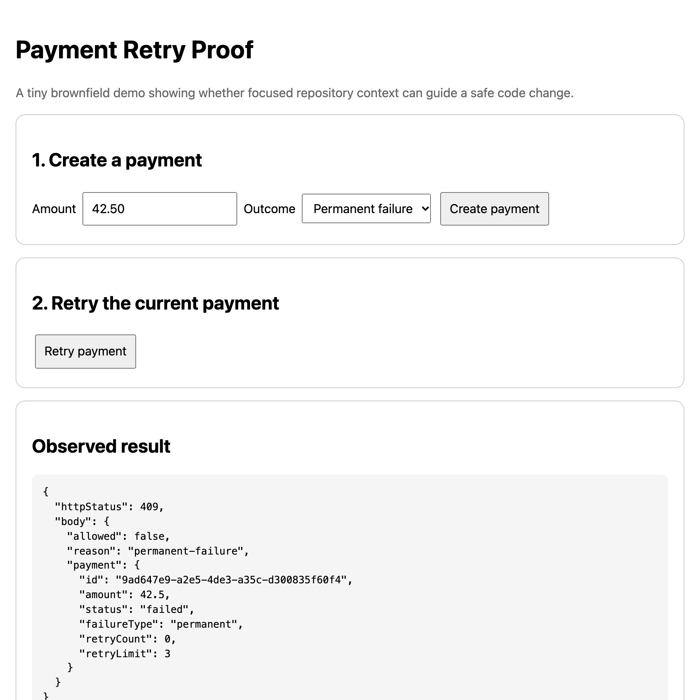

# Evidence

Status: **Intent implemented on 2026-10-07. Automated evidence recorded, including a run of the page in a real browser.**

Everything below is copied from actual runs on Node v20.20.2.

## Evidence Checklist

- [x] transient failure retried below the limit
- [x] permanent failure rejected
- [x] successful payment rejected
- [x] payment at retry limit rejected
- [x] rejected retries do not increment retry count
- [x] public API contract tests pass
- [x] all automated tests pass
- [x] browser UI demonstrates the behavior

The last item was checked by an automated run in headless Chrome, not by a person watching. See Human Demonstration.

## Before the Change

The starter ran 11 tests: 10 passed and 1 failed.

```text
not ok 9 - permanent failure must not retry
  error: Expected values to be strictly equal: true !== false
# tests 11
# pass 10
# fail 1
```

That failing test is the acceptance test for known issue KI-001.

## Test Run

Command:

```bash
npm test
```

Result:

```text
ok 1 - POST /api/payments preserves the public response shape
ok 2 - POST /api/payments/:id/retry preserves the retry response shape
ok 3 - POST /api/payments/:id/retry preserves the rejected retry response shape
ok 4 - creates a successful payment
ok 5 - creates a failed transient payment
ok 6 - allows a retry for a failed payment below the retry limit
ok 7 - rejects retry for a successful payment
ok 8 - rejects retry when retry limit is reached
ok 9 - transient failure may retry below the retry limit
ok 10 - permanent failure must not retry
ok 11 - successful payment must not retry
ok 12 - payment at the retry limit must not retry
# tests 12
# suites 0
# pass 12
# fail 0
# cancelled 0
# skipped 0
# todo 0
```

## Success Criteria

| Criterion from `intent/feature.md` | Evidence |
| --- | --- |
| 1. transient failures can retry below the limit | tests 6 and 9 |
| 2. permanent failures cannot retry | tests 3 and 10 |
| 3. successful payments cannot retry | tests 7 and 11 |
| 4. payments at the retry limit cannot retry | tests 8 and 12 |
| 5. existing public API behavior remains compatible | tests 1, 2, and 3 |
| 6. all repository tests pass | 12 of 12 |

## Implementation Summary

One rule was added to `evaluateRetry` in `src/paymentService.js`:

```js
if (payment.failureType === "permanent") {
  return { allowed: false, reason: "permanent-failure" };
}
```

It sits after the already-succeeded check and before the retry-limit check, and the KI-001 comment was removed. The source change is 4 lines added and 2 removed.

One test was added, test 3 in `tests/contract.test.js`. Before it, no test exercised a rejected retry over HTTP. It checks the 409 status, the response shape, and that the stored `retryCount` is still 0 afterwards.

Not changed: `src/server.js`, `src/store.js`, `public/`, `service-contracts.md`, `database-rules.md`, and `package.json`. No dependency was added.

One decision was not settled by any file: which reason a permanent failure that has also reached its retry limit should report. It reports `permanent-failure`. No test covers that combination.

## Contract Compatibility

- No endpoint, HTTP method, or request shape changed. `src/server.js` is byte-for-byte the starter file.
- The retry response is still `{ allowed, reason, payment }` with the same six payment fields, for both accepted (200) and rejected (409) retries. Tests 2 and 3 assert this over real HTTP.
- `permanent-failure` is a new value of the existing `reason` field. `service-contracts.md` shows that field only as `"reason-code"` and does not list the allowed values, so a client that enumerates reason codes would see a value it has not seen before.
- Observable behavior did change in the intended way: retrying a permanently failed payment used to return 200 and now returns 409.

## Human Demonstration

The page was run in headless Chrome 154 against the server on `127.0.0.1`. A script set the Outcome dropdown, clicked the real **Create payment** and **Retry payment** buttons, and read the text of the **Observed result** panel after each click. This is what the page displayed:

```text
transient create: HTTP 201 status=failed failureType=transient
transient retry 1: HTTP 200 allowed=true reason=retry-allowed retryCount=1
transient retry 2: HTTP 200 allowed=true reason=retry-allowed retryCount=2
transient retry 3: HTTP 200 allowed=true reason=retry-allowed retryCount=3
transient retry 4: HTTP 409 allowed=false reason=retry-limit-reached retryCount=3
permanent create: HTTP 201 status=failed failureType=permanent
permanent retry 1: HTTP 409 allowed=false reason=permanent-failure retryCount=0
success create: HTTP 201 status=succeeded failureType=null
success retry 1: HTTP 409 allowed=false reason=already-succeeded retryCount=0
```

Screenshots of the page after the last click in each case:

- `docs/screenshots/transient.png`
- `docs/screenshots/permanent.png`
- `docs/screenshots/success.png`



The clicks were made by a script, so this shows the page works, not that a person has reviewed it. To watch it yourself: run `npm start`, open http://localhost:3000, create a payment with each of the three outcomes, press Retry, and compare the result panel with the lines above.
